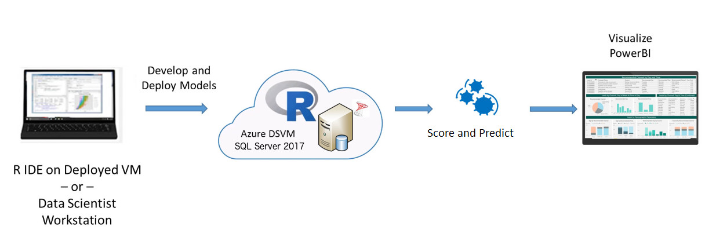

A charged off loan is a loan that is declared by a creditor (usually a lending institution) that an amount of debt is unlikely to be collected, usually when the loan repayment is severely delinquent by the debtor. Given that high chargeoff has negative impact on lending institutions' year end financials, lending institutions often monitor loan chargeoff risk very closely to prevent loans from getting charged-off.
Using Azure HDInsight R Server, a lending institution can leverage machine learning predictive analytics to predict the likelihood of loans getting charged off and run a report on the analytics result stored in HDFS and hive tables. 

<h2>Select the platform you wish to explore:</h2>
 <form style="margin-left:30px"> 
    <label class="radio">
      <input type="radio" name="optradio" class="rb" value="cig" >{{ site.cig_text }}, deployed from <a href="https://aka.ms/loanchargeoffsql">Cortana Intelligence Gallery</a>
    </label>
    <label class="radio">
      <input type="radio" name="optradio" class="rb" value="onp">{{ site.onp_text }}
    </label>
   <label class="radio">
      <input type="radio" name="optradio" class="rb" value="hdi">{{ site.hdi_text }}, deployed from <a href="https://aka.ms/loanchargeoffhdi">Cortana Intelligence Gallery</a>
    </label> 
</form>

On the VM created for you from the <a href="https://aka.ms/loanchargeoffsql">Cortana Intelligence Gallery</a>, the SQL Server 2016 database <code>LoanChargeOff</code> contains all the data and results of the end-to-end modeling process.  

For customers who prefer an on-premise solution, the implementation with SQL Server R Services is a great option that takes advantage of the powerful combination of SQL Server and the R language.  A Windows PowerShell script to invoke the SQL scripts that execute the end-to-end modeling process is provided for convenience. 

This solution shows how to pre-process data (cleaning and feature engineering), train prediction models, and perform scoring on the  HDInsight Spark cluster with Microsoft R Server deployed from the <a href="https://aka.ms/loanchargeoffhdi">Cortana Intelligence Gallery</a>.

<strong>HDInsight Spark cluster billing starts once a cluster is created and stops when the cluster is deleted. See <a href="hdinsight.html"> these instructions for important information</a> about deleting a cluster and re-using your files on a new cluster.</strong>

 We have modeled the steps in the template after a realistic team collaboration on a data science process. Data scientists do the data preparation, model training, and evaluation from their favorite R IDE.using the Open Source Edition of RStudio Server on the cluster edge node.
 
 DBAs can take care of the deployment using SQL stored procedures with embedded R code.  We show how each of these steps can be executed on a SQL Server client environment such as SQL Server Management Studio.
  
 
 Scoring is implemented with <a href="https://msdn.microsoft.com/en-us/microsoft-r/operationalize/about">R Server Operationalization</a>.
 
 Finally, a Power BI report is used to visualize the deployed results.

 

